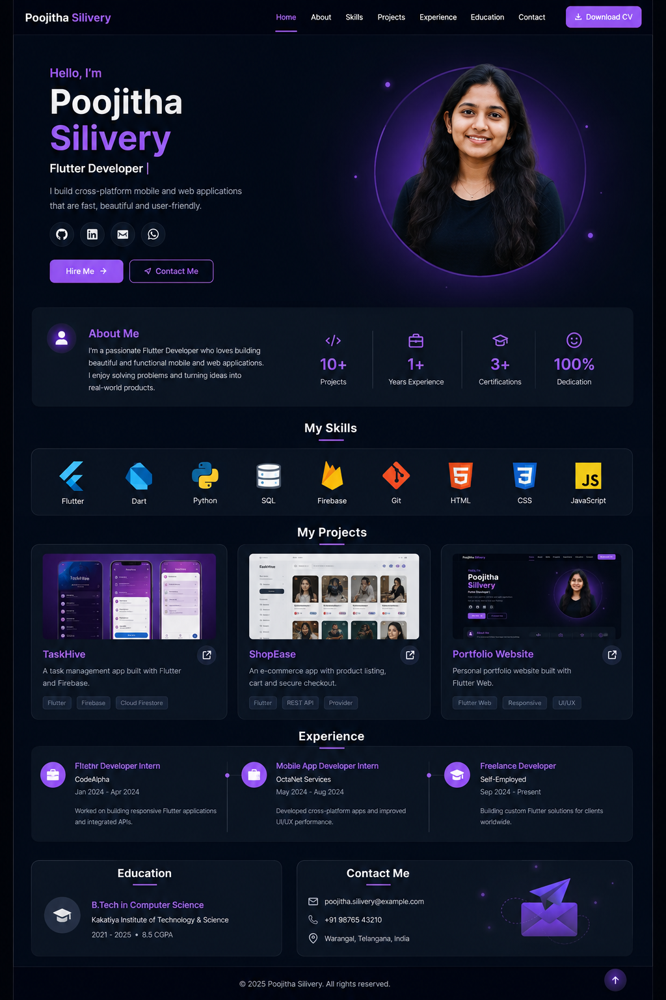

# skill_portfolio

A new Flutter project. 

## Getting Started

This project is a starting point for a Flutter application.

A few resources to get you started if this is your first Flutter project:

- [Lab: Write your first Flutter app](https://docs.flutter.dev/get-started/codelab)
- [Cookbook: Useful Flutter samples](https://docs.flutter.dev/cookbook)

For help getting started with Flutter development, view the
[online documentation](https://docs.flutter.dev/), which offers tutorials,
samples, guidance on mobile development, and a full API reference.
<!-- ============================================================================================ -->

My project Target UI - is 

# Skill Portfolio

A responsive personal portfolio application built using **Flutter and Dart**.

The purpose of this project is to build a professional portfolio while learning and implementing Flutter UI concepts step-by-step. Each major development stage is maintained through Git commits and GitHub pushes.

## 🎯 Project Objective

The Skill Portfolio showcases:

* Personal introduction
* Technical skills
* Projects
* Experience
* Education
* Contact information
* Resume
* Social and professional links

The application is designed to work across:

* Mobile
* Tablet
* Desktop
* Web

## 🛠️ Technologies

* **Flutter**
* **Dart**
* **Git**
* **GitHub**
* **VS Code**

## 📱 Application Sections

The final portfolio will contain the following sections:

1. Navigation Bar
2. Hero Section
3. About Me
4. Skills
5. Projects
6. Experience
7. Education
8. Contact
9. Footer

## 🏗️ Project Structure

```text
Skill-Portfolio-/
│
├── android/                  # Android platform files
├── ios/                      # iOS platform files
├── linux/                    # Linux desktop files
├── macos/                    # macOS platform files
├── web/                      # Web platform files
├── windows/                  # Windows platform files
│
├── lib/                      # Main Flutter application code
│   │
│   ├── main.dart             # Application entry point
│   ├── app.dart              # MaterialApp and application configuration
│   │
│   ├── models/               # Data models
│   │   ├── skill.dart
│   │   ├── project.dart
│   │   └── experience.dart
│   │
│   ├── screens/              # Application screens
│   │   └── home_screen.dart
│   │
│   ├── widgets/              # Reusable UI components
│   │   ├── navbar.dart
│   │   ├── hero_section.dart
│   │   ├── about_section.dart
│   │   ├── skills_section.dart
│   │   ├── projects_section.dart
│   │   ├── experience_section.dart
│   │   ├── education_section.dart
│   │   ├── contact_section.dart
│   │   └── footer.dart
│   │
│   ├── data/                 # Portfolio data
│   │   ├── skills_data.dart
│   │   ├── projects_data.dart
│   │   └── experience_data.dart
│   │
│   ├── theme/                # Application theme
│   │   ├── app_theme.dart
│   │   ├── app_colors.dart
│   │   └── app_text_styles.dart
│   │
│   └── utils/                # Utility/helper classes
│       ├── responsive.dart
│       └── constants.dart
│
├── assets/                   # Application assets
│   ├── images/
│   ├── icons/
│   └── resume/
│
├── test/                     # Flutter tests
│
├── pubspec.yaml              # Flutter project configuration
├── analysis_options.yaml     # Dart/Flutter analysis rules
├── .gitignore                # Git ignored files
└── README.md                 # Project documentation
```

## 📚 Flutter Concepts Covered

This project is developed progressively to implement important Flutter concepts.

### UI Fundamentals

* `MaterialApp`
* `Scaffold`
* `Container`
* `Row`
* `Column`
* `Stack`
* `Padding`
* `SizedBox`
* `Expanded`
* `Flexible`

### Flutter Widgets

* `StatelessWidget`
* `StatefulWidget`
* Custom widgets
* Reusable components
* Cards
* Buttons
* Icons
* Images
* Text widgets

### Layout and Responsive Design

* `MediaQuery`
* `LayoutBuilder`
* Responsive layouts
* Mobile layout
* Tablet layout
* Desktop layout
* Web layout

### Lists and Collections

* `ListView`
* `GridView`
* Dynamic lists
* Model-based UI

### Navigation

* Navigation concepts
* Section navigation
* External links
* GitHub links
* LinkedIn links
* Email/contact actions

### Forms

* `TextField`
* `Form`
* Form validation
* Contact form

### Styling

* `ThemeData`
* Custom colors
* Typography
* Reusable text styles
* Dark theme
* Consistent UI design

### Assets

* Images
* Icons
* Profile image
* Project images
* Resume/document assets

### Advanced UI

* Animations
* Hover effects
* Transitions
* Responsive components

### Development Tools

* VS Code
* Flutter CLI
* Flutter DevTools
* Git
* GitHub

## 🔄 Development Methodology

The project follows an incremental development approach.

```text
Learn Flutter Concept
        ↓
Implement Concept
        ↓
Test Application
        ↓
Git Commit
        ↓
GitHub Push
        ↓
Move to Next Section
```

Each major feature will have a separate Git commit.

## 📌 Development Roadmap

| Stage | Feature        | Main Flutter Concepts         |
| ----- | -------------- | ----------------------------- |
| 01    | Project Setup  | Flutter CLI, Dart             |
| 02    | App Foundation | MaterialApp, Scaffold         |
| 03    | Basic Layout   | Row, Column, Container        |
| 04    | Navigation     | AppBar, navigation            |
| 05    | Hero Section   | Stack, responsive layout      |
| 06    | About Section  | Custom widgets                |
| 07    | Skills         | ListView, GridView            |
| 08    | Projects       | Cards, images                 |
| 09    | Experience     | Layout, reusable widgets      |
| 10    | Education      | Cards, layout                 |
| 11    | Contact        | Forms, TextField              |
| 12    | Theme          | ThemeData, colors, typography |
| 13    | Responsive UI  | MediaQuery, LayoutBuilder     |
| 14    | Animations     | Animation and transitions     |
| 15    | Assets         | Images, icons, resume         |
| 16    | Testing        | Flutter testing               |
| 17    | Final Release  | GitHub and deployment         |

## 🚀 Getting Started

### Clone the repository

```bash
git clone https://github.com/Poojithasilivery/Skill-Portfolio-.git
```

### Navigate to the project

```bash
cd Skill-Portfolio-
```

### Install dependencies

```bash
flutter pub get
```

### Check Flutter environment

```bash
flutter doctor
```

### Check available devices

```bash
flutter devices
```

### Run on Linux

```bash
flutter run -d linux
```

### Run on Chrome

```bash
flutter run -d chrome
```

## 🔀 Git Development

The project uses Git for version control.

Example workflow:

```bash
git status

git add .

git commit -m "Add portfolio hero section"

git push origin main
```

Major features will be committed separately so that the development history clearly shows how the application was built.

## 📈 Future Enhancements

* Add animations
* Add dark/light theme switching
* Add downloadable resume
* Add GitHub API integration
* Add project filtering
* Add contact form backend
* Deploy Flutter Web version
* Improve accessibility
* Add SEO-related web configuration

## 👩‍💻 Author

**Poojitha Silivery**

GitHub:
https://github.com/Poojithasilivery

## 📄 License

This project is created for learning, academic, and portfolio purposes.
==============================================================================
Perfect. Since you have now successfully initialized the Flutter project with:

```bash
flutter create --project-name skill_portfolio .
```

let's finalize **two things now**:

1. `README.md`
2. Clean project structure

We will **not create all Dart files yet**. We'll create folders/files section-by-section as we implement the UI.

## 1. Final `README.md`

Replace the generated `README.md` with this:

# Skill Portfolio

A responsive personal portfolio application built using **Flutter and Dart**.

The purpose of this project is to build a professional portfolio while learning and implementing Flutter UI concepts step-by-step. Each major development stage is maintained through Git commits and GitHub pushes.

## 🎯 Project Objective

The Skill Portfolio showcases:

* Personal introduction
* Technical skills
* Projects
* Experience
* Education
* Contact information
* Resume
* Social and professional links

The application is designed to work across:

* Mobile
* Tablet
* Desktop
* Web

## 🛠️ Technologies

* **Flutter**
* **Dart**
* **Git**
* **GitHub**
* **VS Code**

## 📱 Application Sections

The final portfolio will contain the following sections:

1. Navigation Bar
2. Hero Section
3. About Me
4. Skills
5. Projects
6. Experience
7. Education
8. Contact
9. Footer

## 🏗️ Project Structure

```text
Skill-Portfolio-/
│
├── android/                  # Android platform files
├── ios/                      # iOS platform files
├── linux/                    # Linux desktop files
├── macos/                    # macOS platform files
├── web/                      # Web platform files
├── windows/                  # Windows platform files
│
├── lib/                      # Main Flutter application code
│   │
│   ├── main.dart             # Application entry point
│   ├── app.dart              # MaterialApp and application configuration
│   │
│   ├── models/               # Data models
│   │   ├── skill.dart
│   │   ├── project.dart
│   │   └── experience.dart
│   │
│   ├── screens/              # Application screens
│   │   └── home_screen.dart
│   │
│   ├── widgets/              # Reusable UI components
│   │   ├── navbar.dart
│   │   ├── hero_section.dart
│   │   ├── about_section.dart
│   │   ├── skills_section.dart
│   │   ├── projects_section.dart
│   │   ├── experience_section.dart
│   │   ├── education_section.dart
│   │   ├── contact_section.dart
│   │   └── footer.dart
│   │
│   ├── data/                 # Portfolio data
│   │   ├── skills_data.dart
│   │   ├── projects_data.dart
│   │   └── experience_data.dart
│   │
│   ├── theme/                # Application theme
│   │   ├── app_theme.dart
│   │   ├── app_colors.dart
│   │   └── app_text_styles.dart
│   │
│   └── utils/                # Utility/helper classes
│       ├── responsive.dart
│       └── constants.dart
│
├── assets/                   # Application assets
│   ├── images/
│   ├── icons/
│   └── resume/
│
├── test/                     # Flutter tests
│
├── pubspec.yaml              # Flutter project configuration
├── analysis_options.yaml     # Dart/Flutter analysis rules
├── .gitignore                # Git ignored files
└── README.md                 # Project documentation
```

## 📚 Flutter Concepts Covered

This project is developed progressively to implement important Flutter concepts.

### UI Fundamentals

* `MaterialApp`
* `Scaffold`
* `Container`
* `Row`
* `Column`
* `Stack`
* `Padding`
* `SizedBox`
* `Expanded`
* `Flexible`

### Flutter Widgets

* `StatelessWidget`
* `StatefulWidget`
* Custom widgets
* Reusable components
* Cards
* Buttons
* Icons
* Images
* Text widgets

### Layout and Responsive Design

* `MediaQuery`
* `LayoutBuilder`
* Responsive layouts
* Mobile layout
* Tablet layout
* Desktop layout
* Web layout

### Lists and Collections

* `ListView`
* `GridView`
* Dynamic lists
* Model-based UI

### Navigation

* Navigation concepts
* Section navigation
* External links
* GitHub links
* LinkedIn links
* Email/contact actions

### Forms

* `TextField`
* `Form`
* Form validation
* Contact form

### Styling

* `ThemeData`
* Custom colors
* Typography
* Reusable text styles
* Dark theme
* Consistent UI design

### Assets

* Images
* Icons
* Profile image
* Project images
* Resume/document assets

### Advanced UI

* Animations
* Hover effects
* Transitions
* Responsive components

### Development Tools

* VS Code
* Flutter CLI
* Flutter DevTools
* Git
* GitHub

## 🔄 Development Methodology

The project follows an incremental development approach.

```text
Learn Flutter Concept
        ↓
Implement Concept
        ↓
Test Application
        ↓
Git Commit
        ↓
GitHub Push
        ↓
Move to Next Section
```

Each major feature will have a separate Git commit.

## 📌 Development Roadmap

| Stage | Feature        | Main Flutter Concepts         |
| ----- | -------------- | ----------------------------- |
| 01    | Project Setup  | Flutter CLI, Dart             |
| 02    | App Foundation | MaterialApp, Scaffold         |
| 03    | Basic Layout   | Row, Column, Container        |
| 04    | Navigation     | AppBar, navigation            |
| 05    | Hero Section   | Stack, responsive layout      |
| 06    | About Section  | Custom widgets                |
| 07    | Skills         | ListView, GridView            |
| 08    | Projects       | Cards, images                 |
| 09    | Experience     | Layout, reusable widgets      |
| 10    | Education      | Cards, layout                 |
| 11    | Contact        | Forms, TextField              |
| 12    | Theme          | ThemeData, colors, typography |
| 13    | Responsive UI  | MediaQuery, LayoutBuilder     |
| 14    | Animations     | Animation and transitions     |
| 15    | Assets         | Images, icons, resume         |
| 16    | Testing        | Flutter testing               |
| 17    | Final Release  | GitHub and deployment         |

## 🚀 Getting Started

### Clone the repository

```bash
git clone https://github.com/Poojithasilivery/Skill-Portfolio-.git
```

### Navigate to the project

```bash
cd Skill-Portfolio-
```

### Install dependencies

```bash
flutter pub get
```

### Check Flutter environment

```bash
flutter doctor
```

### Check available devices

```bash
flutter devices
```

### Run on Linux

```bash
flutter run -d linux
```

### Run on Chrome

```bash
flutter run -d chrome
```

## 🔀 Git Development

The project uses Git for version control.

Example workflow:

```bash
git status

git add .

git commit -m "Add portfolio hero section"

git push origin main
```

Major features will be committed separately so that the development history clearly shows how the application was built.

## 📈 Future Enhancements

* Add animations
* Add dark/light theme switching
* Add downloadable resume
* Add GitHub API integration
* Add project filtering
* Add contact form backend
* Deploy Flutter Web version
* Improve accessibility
* Add SEO-related web configuration

## 👩‍💻 Author

**Poojitha Silivery**

GitHub:
[https://github.com/Poojithasilivery](https://github.com/Poojithasilivery)

## 📄 License

This project is created for learning, academic, and portfolio purposes.

---

# 2. Recommended final project structure

Now let's understand the structure before creating it.

```text
Skill-Portfolio-
│
├── lib/
│   │
│   ├── main.dart
│   │
│   ├── app.dart
│   │
│   ├── screens/
│   │   └── home_screen.dart
│   │
│   ├── widgets/
│   │   ├── navbar.dart
│   │   ├── hero_section.dart
│   │   ├── about_section.dart
│   │   ├── skills_section.dart
│   │   ├── projects_section.dart
│   │   ├── experience_section.dart
│   │   ├── education_section.dart
│   │   ├── contact_section.dart
│   │   └── footer.dart
│   │
│   ├── models/
│   │   ├── skill.dart
│   │   ├── project.dart
│   │   └── experience.dart
│   │
│   ├── data/
│   │   ├── skills_data.dart
│   │   ├── projects_data.dart
│   │   └── experience_data.dart
│   │
│   ├── theme/
│   │   ├── app_theme.dart
│   │   ├── app_colors.dart
│   │   └── app_text_styles.dart
│   │
│   └── utils/
│       ├── responsive.dart
│       └── constants.dart
│
├── assets/
│   ├── images/
│   ├── icons/
│   └── resume/
│
├── test/
│
├── android/
├── ios/
├── linux/
├── macos/
├── web/
├── windows/
│
├── pubspec.yaml
├── analysis_options.yaml
├── .gitignore
└── README.md
```

### The most important concept

Don't think of this as 30+ files.

Think of it as **six responsibilities**:

```text
                    SKILL PORTFOLIO
                          │
       ┌──────────────────┼──────────────────┐
       ↓                  ↓                  ↓
     screens            widgets             models
   WHERE screen       HOW it looks        WHAT data
       │                  │                  │
       └──────────────────┼──────────────────┘
                          ↓
                        data
                   actual portfolio
                       content
                          │
             ┌────────────┴────────────┐
             ↓                         ↓
           theme                     utils
       colors/fonts              responsive/helpers
```

For example:

**`models/project.dart`**

> What is a project?

**`data/projects_data.dart`**

> Which projects does Poojitha have?

**`widgets/projects_section.dart`**

> How should those projects appear on screen?

That separation will make the project much easier to understand and maintain.

---

## 3. But don't create all these files yet

This is important for our **syllabus + GitHub push strategy**.

Right now we should keep the generated Flutter project clean.

Our first milestone is:

```text
PUSH 01
│
├── Flutter project initialized
├── README.md completed
├── pubspec.yaml
├── main.dart
└── Default Flutter application
```

Then:

```text
PUSH 02
│
└── Application foundation
    ├── app.dart
    └── home_screen.dart
```

Then we'll progressively add:

```text
PUSH 03 → Basic Flutter layouts
PUSH 04 → Navigation
PUSH 05 → Hero
PUSH 06 → About
PUSH 07 → Skills
PUSH 08 → Projects
PUSH 09 → Experience
PUSH 10 → Education
PUSH 11 → Contact
PUSH 12 → Theme
PUSH 13 → Responsive design
PUSH 14 → Animations
PUSH 15 → Assets
PUSH 16 → Testing
PUSH 17 → Final release
```

So **every GitHub push becomes a learning milestone**.

### Right now

After replacing `README.md`, run:

```bash
flutter pub get
flutter analyze
flutter run -d linux
```

If the default Flutter app runs successfully, our **first commit** can be:

```bash
git status
git add README.md .
git commit -m "Initialize Flutter skill portfolio project"
```

Then we'll inspect the Git branch before pushing, because your original empty repository didn't have a local branch yet.

**After that, we'll start PUSH 02 with `main.dart → app.dart → HomeScreen` and build the foundation of the final UI.**
